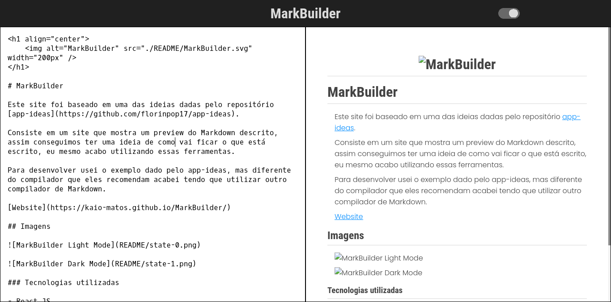
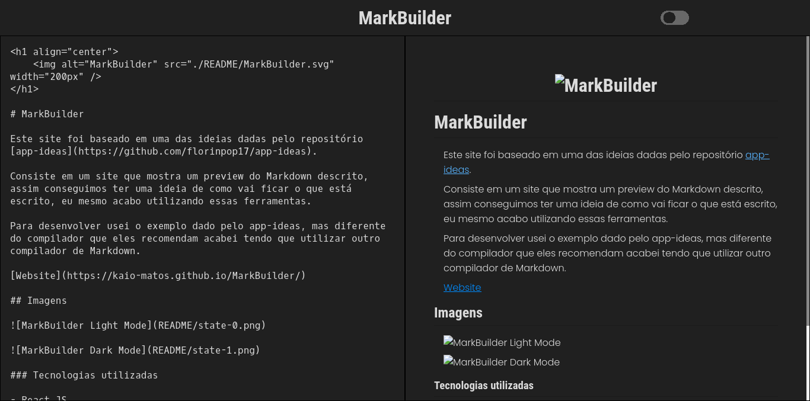

<h1 align="center">
    
</h1>

# MarkBuilder

Este site foi baseado em uma das ideias dadas pelo repositório [app-ideas](https://github.com/florinpop17/app-ideas).

Consiste em um site que mostra um preview do Markdown descrito, assim conseguimos ter uma ideia de como vai ficar o que está escrito, eu mesmo acabo utilizando essas ferramentas.

Para desenvolver usei o exemplo dado pelo app-ideas, mas diferente do compilador que eles recomendam acabei tendo que utilizar outro compilador de Markdown.

[Website](https://kaio-matos.github.io/MarkBuilder/)

## Imagens

### Tecnologias utilizadas

- React JS
- Typescript
- HTML
- CSS
